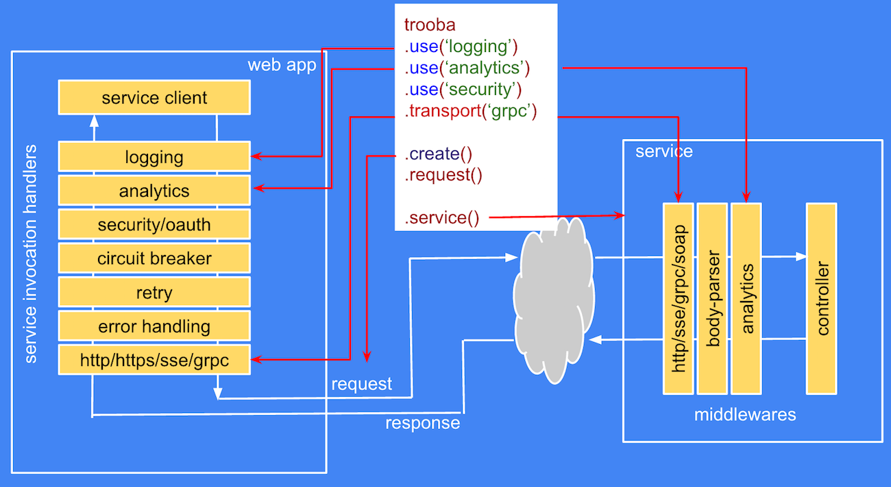

# trooba

"Trooba" [tru:ba'] means "Pipe" in Russian

The module may serve as a base to create a pipeline to handle request/response flow at the service and client side.



Trooba is a stateless generic pipeline that can be used to execute multiple requests or responses/chunks in parallel without any conflicts as the contextual information is passed along with a request and a response object.

Allows to:
* Set a transport (http, soap, grpc, mock or custom) to a pipeline
* Create a pipeline of handlers
    * The handlers are executed in order they were added.
    * The request object is passed from client through a set of handlers before getting to the transport
    * The response object is passed in the reverse order of handlers from transport to the client.
* Define a client API; which can be different from what is returned by default.

## Install

```
npm install trooba --save
```

## Usage

```js
var Trooba = require('trooba');

var trooba = Trooba
    // setting transport or you can use module reference
    .transport(function (pipe) {
        // hook to request
        pipe.on('request', function (request) {
            // respond
            pipe.respond('Hello ' + request.name);
        })
    })
    // adding handler to collect metrics
    .use(function (pipe) {
        var start;
        pipe.on('request', function (request, next) {
            start = Date.now();
            next(); // continue with request
        })
        pipe.on('response', function (response, next) {
            console.log('call time is', Date.now() - start, 'ms');
            next(); // continue with reponse flow
        })
    })  
    .use(retry, 2); // retry 2 times, see example of retry handler below

// request is re-usable and can be called many times in parallel
// Make service calls
// ================================== //
trooba.create({  // injecting context
    foo: bar   
})
.request({
    qwe: 'asd'
})
.on('error', console.error)
.on('response', console.log);
// ================================== //
// Or you can do it with callback
trooba.create({  // injecting context
    foo: bar   
})
.request({
    qwe: 'asd'
}, console.log);
// ================================== //
```

### Trooba API

* **transport**(transport[, config]) is an optional method that hooks the pipeline to the specific transport
   * *transport* is a function (pipe) that defines transport logic
   * *config* is a config object that contains configuration info for the transport
* **interface**([function implementation(pipe)]) is an optional method to inject a custom client interface that would be returned by *create* method
* **use**(handler[, config]) adds a handler to the pipeline
   * *handler* is a handler function(pipe){}
   * *config* is a config object for the handler
* **create**([context]) creates a generic request function or the client object defined by the transport API or via *interface* method. It allows to inject context that would be merged into requestContext object.

### Pipe Object API

The pipe object is passed to all handlers and transport during initialization whenever new context is created via trooba.create(context) or pipe.create(context) call.

#### Methods

* **create**([context]) - creates a pipeline with new context or clones from the existing one if any present. THe method is mandatory to initiate a new request flow, otherwise the subsequent call will fail.
* **request**(requestObject) - creates and sends an arbitrary request down the pipeline. If context was not used, it will implicitly call *create* method
* **throw**(Error) - sends the error down the response pipeline. If no error hooks defined in the pipeline, it will throw error. The method can be called only after the response flow is initiated.
* **respond**(responseObject) - initiates a response flow and sends an arbitrary response object down the response pipeline. This can be called only after the request flow is initiated.
* **send**(message) - sends a message down the request or response flow depending on the message type. For more details see message structure below. The method can be used to send a custom message.

#### Message structure

* **type** is a String that defines a message type which can be used in pipe.on() and .once()
* **flow** is a Number that defines flow type. It will define the direction of the message in the pipeline
    * 1 - request
    * 2 - response
* **ref** is a reference to the data being sent in the message
* The rest of the fields will be assigned by the framework and should not be changed

```json
{
    "type": "error",
    "flow": 1,
    "ref": "[Error: some error message]"
}
```

### Transport

Transport should provide an actual call using specific protocol like http/grpc/soap/rest that should be implemented by the transport provider.
It can also provide a custom API that will be exposed as if it was client native.

#### Transport API

Transport accepts two parameters:
* **pipe** holds a reference to the pipeline; for more info please see definition below.
* **reply** is a function([responseContext]|([err], [response])) used to initiate response flow.

#### Transport usage

```js
// throw error
function transport(pipe) {
    pipe.on('request', function (request) {
        pipe.throw(new Error('Error'));
    })
}

// reply with http response
function transport(pipe) {
    pipe.on('request', function (request) {
        pipe.respond({
            statusCode: 200,
            body: 'ok'
        });
    })
}

// accessing context information
function transport(pipe) {
    // executed only once here for every request
    console.log('context info:', pipe.context);
    pipe.on('request', function () {
        // or here
        console.log('context info within request flow:', pipe.context);
        pipe.respond('ok');
    })
}
```

#### Transport definition using http protocol as a base

For more advanced example please see [trooba-http-transport](https://github.com/trooba/trooba-http-transport) module

```js
var Http = require('http');

function transport(pipe, config) {
    pipe.on('request', function (request) {
        var options = Object.create(config);
        options.path += '?' + Querystring.stringify(request);
        // prepare request
        var req = Http.request(options, function (res) {
            var data = '';
            res.setEncoding('utf8');
            res.on('data', function (chunk) {
                data += chunk;
            });
            res.on('end', function () {
                res.body = data;
                pipe.respond(res);
            });
        });

        req.on('error', function (err) {
            pipe.throw(err);
        });

        req.end();
    });
}

var pipe = Trooba.transport(transportFactory, {
    protocol: 'https:',
    hostname: 'www.google.com',
    path: '/search?q=nike'
}).create();

// REQUEST execution
// ========================================= //
pipe.request({
    q: 'nike'
}, (err, response) => console.log);

// or you can skip callback and listen to events
// ========================================= //
pipe.request({
    q: 'nike'
})
.on('error', console.error)
.on('response', console.log);
// ========================================= //
```

#### Transport definition using http protocol and custom API

```js
function transportFactory() {
    function transport(pipe, config) {
        pipe.on('request', function (request) {
            var qs = '?' + Querystring.stringify(request);
            var options = {
                protocol: config.protocol,
                hostname: config.hostname,
                path: config.path ?
                    config.path += qs : qs
            };
            // prepare request
            var req = Http.request(options, function (res) {
                var data = '';
                res.setEncoding('utf8');
                res.on('data', function (chunk) {
                    data += chunk;
                });
                res.on('end', function () {
                    res.body = data;
                    pipe.respond(res);
                });
            });

            req.on('error', function (err) {
                pipe.throw(err);
            });

            req.end();
        });
    }

    transport.api = pipe => {
        return {
            search: (name, callback) => {
                pipe.create()
                .on('error', err => {
                    callback(err);
                })
                .on('response', response => {
                    callback(null, response.body);
                })
                .request({
                    q: name
                });
            }
        };
    };

    return transport;
}

var client = Trooba.transport(transportFactory(), {
    protocol: 'http:',
    hostname: 'www.google.com',
    path: '/search'
}).create();

client.search('nike', console.log);
```

### Interface

Allows to define a custom client API if the generic request function is not enough.

```js
Trooba.interface(function implementation(pipe) {});
```

The interface implementation should be a function that returns a new function or service client object.
The function is injected with a pipe object that allows to [re-]initiate the pipeline flow as well as hook to various events running within the pipeline.

```js
var client = Trooba.transport(transportFactory, {
    protocol: 'https:',
    hostname: 'www.google.com',
    path: '/search'
})
.interface(function api(pipe) {
    return {
        search: (name, callback) => {
            pipe.create().request( {
                q: name
            }, callback);
        }
    }
})
.create();
// invoking
client.search('nike', (err, response) => console.log);
```

#### Custom API via interface with configuration

```js
Trooba.transport(transport, {
    protocol: 'https:',
    hostname: 'www.google.com',
    path: '/search'
})
.interface(function api(pipe, config) {
    return {
        search: (name, callback) => {
            pipe.create().request( {
                q: name
            }, callback);
        }
    }
}
})
.create().search('nike', (err, response) => console.log);
```

### Handler definition

Each handler should perform a unique function within a pipeline, such as error handling, retry logic, tracing.

The handler has the same signature as the transport, the difference only in what one does with pipe and what events it listens to.


##### Request flow only handler

```js
function handler(pipe, config) {
    // manipulate request context
    pipe.context.fa1 = 'zx1';
    // wait for request and pass control back to the pipeline via next()
    pipe.on('request', function (request, next) {
        request.foo = 'bar'; // modify request
        // pass control back to pipeline with the same request
        next();
        // or you can re-write the request completely
        /*
        next({
            qaz: 'frt'
        })
        */
    })
    // wait for response and change it
    pipe.on('response', function (response, next) {
        // modifying the response
        response.wer = 'wer';
        // pass control back to the pipeline
        next();
        // of we can re-write response completely
        /*
        next({
            my: 'new response'
        })
        */
    })
}
```

##### Request/response flow handler

```js
function handler(pipe) {
    // manipulate request context
    pipe.fa1 = 'zx1';
    var requestObj;
    pipe.on('request', function (request, next) {
        // modify request object if needed
        request.foo = 'bar';
        // modify shared data
        requestObj = request;
        // pass control to the next handler in request pipeline
        next();
        /*

        // you can also stop the flow an respond if needed or throw error
        pipe.respond('Hi');

        // throw Error
        pipe.throw(new Error());

        */
    });

    pipe.on('response', function (response, next) {
        // modify response object if needed
        response.body = JSON.parse(response.body);
        // access context
        console.log(pipe.context);
        // pass control down the response flow
        next();

        /*

        // or replace the response
        next({
            my: 'new response'
        })

        // of you can re-initiate request flow with shared request object
        pipe.request(requestObj);

        // or throw error
        pipe.throw(new Error());

        */
    })
}
```

##### Reply with error

```js
function handlerFactory() {
    return function handler(pipe) {
        pipe.on('request', function (request) {
            // pass control to the response handler
            pipe.throw(new Error('Bad response'));
        })
    };
}
```

##### Reply with response

```js
function handlerFactory() {
    return function handler(pipe) {
        pipe.on('request', function (request) {
            // pass control to the response handler
            pipe.respond({
                statusCode: 200,
                body: 'Hello world'
            });
        })
    };
}
```

##### Continue the existing response flow

```js
function handlerFactory() {
    return function handler(requestContext, action) {
        pipe.on('response', function (response, next) {
            next();
        });
    };
}
```

##### Continue an existing request flow

```js
function handlerFactory() {
    return function handler(requestContext, action) {
        pipe.on('request', function (request, next) {
            next();
        })
    };
}
```

#### Retry handler example

```js
var Assert = require('assert');
var Trooba = require('trooba');

var retryCounter = 0;

function retry(pipe, config) {
    pipe.on('request', function (request, next) {
        var retry = config.retry;

        pipe.on('error', function (err) {
            if (retry-- > 0) {
                // re-try request
                retryCounter++;
                pipe.request(request);
                return;
            }
            pipe.throw(err);
        });

        // continue with request flow
        next();
    });
}

// mock transport
function mockTransportFactory(config) {
    var count = 1;
    return function mock(requestContext, action) {
        // first generate error
        if (count-- > 0) {
            return action.reply(new Error('Test error'));
        }
        action.reply(null, 'some text');
    };
}

// mock transport
function createMockTransport() {
    var count = 1;
    return function mock(pipe) {
        pipe.on('request', function () {
            // first generate error
            if (count-- > 0) {
                return pipe.throw(new Error('Test error'));
            }
            pipe.respond('some text');
        });
    };
}

var client = Trooba.transport(createMockTransport())
    .use(retry, { retry: 1 })
    .create();

client.request({}, function (err, response) {
    Assert.ok(!err, err && err.stack);
    Assert.equal('some text', response);
    Assert.equal(1, retryCounter);
    done();
});
```

## Examples

### Ajax client

Based on [trooba-xhr-transport](https://github.com/trooba/trooba-xhr-transport)

```js
var xhrTransportFactory = require('trooba-xhr-transport');
require('trooba')
    .transport(xhrTransportFactory, {
        protocol: 'http:',
        hostname: 'myapi.service.xyz'
        socketTimeout: 1000
    })
    .create()
    .get({
        q: 'nike'
    })
    .set('some', 'header')
    .end(function (err, response) {
        console.log(err, response && response.body)
    });
```

### RESTful client

Based on [trooba-http-transport](https://github.com/trooba/trooba-http-transport)

```js
require('trooba')
    .transport(httpTransportFactory, {
        protocol: 'http:',
        hostname: 'www.google.com',
        connectTimeout: 100,
        socketTimeout: 1000
    })
    .create()
    .get({
        q: 'nike'
    })
    .set('some', 'header')
    .end(function (err, response) {
        console.log(err, response && response.body)
    });
```

### gRPC client

Based on [trooba-grpc-transport](https://github.com/trooba/trooba-grpc-transport)

```js
var grpcTransportFactory = require('trooba-grpc-transport');

require('trooba')
    .transport(grpcTransportFactory, {
        protocol: 'http:',
        hostname: 'grpc.service.my',
        port: 50001,
        proto: require.resolve('path/to/hello.proto')
    })
    .create()
    .hello('Bob', function (err, response) {
        console.log(err, response)
    });
```

### Mocking

```js
var request = require('trooba')
    .transport(function mockFactory() {
        return mock(requestContext, reply) {
            reply(new Error('Simulate error'));
        }
    })
    .create();

request({foo:'bar'}, function (err, response) {
    console.log(err, response)
});
```
