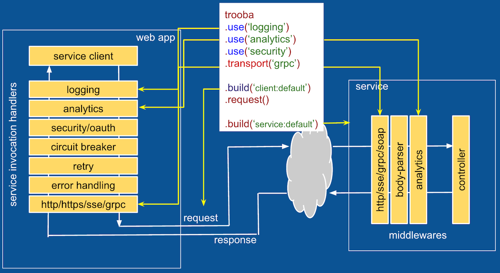

# trooba

[](https://codecov.io/gh/trooba/trooba)
[](https://travis-ci.org/trooba/trooba) [](https://www.npmjs.com/package/trooba)
[](http://npm-stat.com/charts.html?package=trooba)
[](https://snyk.io/test/github/trooba/trooba)

"Trooba" [tru:ba'] means "Pipe" in Russian

## What is it?

Trooba a fast isomorphic lightweight framework to build pipelines for request/response, stream/response, request/response and stream/stream use-cases spanning from a browser to a front-end app and further to a backend service.

It uses a stateless generic pipeline/bus used to route multiple requests in "parallel" without any conflicts. The contextual information is passed along with the message.

## What is it not?

It is not another http based server framework like express, koa or hapi. It can be used to build a pipline for those as it is protocol free and allows to specify any transport one needs. For example see [examples](#examples)

## What can it do for you?

* Define a pipeline of handlers and execute it
    * The handlers are executed in order they were added.
* Define a service client:
    * The request object is passed from client through a set of handlers before getting to the transport handler
    * The response object is passed in the reverse order of handlers from transport handler to the client.
* Define a service:
    * The request object is passed from transport through a set of handlers before getting to the controller
    * The response object is passed in the reversed order from the controller defined by the user through a set of handlers to the transport of the service.
* Set transport handler or a set of them in the fallback order (http, soap, grpc, mock or custom) for a pipeline
* Customize API returned by pipe.build(customApiName) method mostly useful to provide a protocol specific API, for example, gRPC can expose API defined in proto file or soap API defined by wsdl.
* Support for request/response, pub/sub or a mix of the modes



# Get Involved

- **Contributing**: Pull requests are welcome!
    - Read [`CONTRIBUTING.md`](.github/CONTRIBUTING.md) and check out our [bite-sized](https://github.com/trooba/trooba/issues?q=is%3Aissue+is%3Aopen+label%3Adifficulty%3Abite-sized) and [help-wanted](https://github.com/trooba/trooba/issues?q=is%3Aissue+is%3Aopen+label%3Astatus%3Ahelp-wanted) issues
    - Submit github issues for any feature enhancements, bugs or documentation problems
- **Support**: Join our [gitter chat](https://gitter.im/trooba) to ask questions to get support from the maintainers and other Trooba developers
    - Questions/comments can also be posted as [github issues](https://github.com/trooba/trooba/issues)


## Install

```
npm install trooba --save
```

## Usage

#### Build a pipe

```js
var pipe = require('trooba')
    // adding handler to collect metrics
    .use(function (pipe) {
        var start;
        pipe.on('request', function (request, next) {
            start = Date.now();
            next(); // continue with request
        })
        pipe.on('response', function (response, next) {
            console.log('call time is', Date.now() - start, 'ms');
            next(); // continue with reponse flow
        })
    })  
    .use(retry, 2); // retry 2 times, see example of retry handler below
```

#### Assign a transport

```js
// setting transport or you can use module reference
pipe.use(function transport(pipe) {
    // hook to request
    pipe.on('request', function (request) {
        // respond
        pipe.respond('Hello ' + request.name);
    })
})
```

#### Make a request

Injecting static context if any needed or this can be skipped.
```js
pipe = pipe.build({  
    foo: bar   
})
```
At this point the pipe becomes re-usable between multiple "parallel" requests.

Make a request
```js
pipe.create()
    .request({
        qwe: 'asd'
    })
    .on('error', console.error)
    .on('response', console.log);
// ================================== //
```

Or you can do it with a callback style
```js
pipe.create()
    .request({
        qwe: 'asd'
    }, console.log);
// ================================== //
```

**Note:** Though pipe API to add hooks looks like event emitter, it does not allow multiple hooks and will throw error if one attempts to add a hook for the event that already has it.
If you really need to support multiple listeners, you can add an event dispatcher as a hook.

### Trooba API

* **use**(handler[, config]) adds a handler to the pipeline
   * *handler* is a function handler(pipe){}
   * *config* is a config object for the handler
* **build*([context]) creates a pipe and returns pipe object or the client object defined by the transport API or via *interface* method. It allows to inject context that would be available to all handlers.
* **set**(name, value) used set system value to the context. The name is prefixed with '$' that prevents it from being propagated beyond the pipe boundaries.
* **get**(name) is used to get system value from the context.

### Pipe API

The pipe object is passed to all handlers and transport during initialization whenever new context is created via trooba.build(context) or pipe.create(context) call.

* **create**([context]) - creates a pipeline with new context or clones from the existing one if any present. The method is mandatory to initiate a new flow, otherwise the subsequent call will fail.
* **request**(requestObject) - creates and sends an arbitrary request down the pipeline. If context was not used, it will implicitly call *create* method
* **streamRequest**(requestObject) - creates and sends an arbitrary request down the pipeline. If context was not used. It returns write stream with methods:
    * **write(data)** write a chunk to the stream as "request:data" message
    * **end()** ends the stream and send "request:end" message
* **throw**(Error) - sends the error down the response pipeline. If no error hooks defined in the pipeline, it will throw error. The method can be called only after the response flow is initiated.
* **respond**(responseObject) - initiates a response flow and sends an arbitrary response object down the response pipeline. This can be called only after the request flow is initiated.
* **streamResponse**(responseObject) - initiates a response stream flow and sends an arbitrary response object down the response pipeline. This can be called only after the request flow is initiated. It returns write stream with methods:
    * **write(data)** write a chunk to the stream as "response:data" message
    * **end()** ends the stream and send "response:end" message
* **send**(message) sends a message down the request or response flow depending on the message type. For more details see message structure below. The method can be used to send a custom message.
* **trace**([Function tracer(message, pipe)]) enables tracing for the messages. It is kind of a visitor pattern. The function will be called for any message going through every pipe point and you are free to use it in any way imaginable. One obvious option is to trace the route using a special message type or trace request/response route with request and response.
* **context** is an object available to all handlers/transport in the same request/response flow. One can use it to store data that needs to be shared between handlers if needed. The values in the context that have their names started with '$' will not be propagated beyond the pipe boundaries.
* **set**(name, value) sets arbitrary system key-value pair to the context which will not be explicitly propagated beyond transport boundaries as internally the name will be prefixed as $name. It is used to provide custom API by handlers.
* **get**(name) reads system value from the context.

#### Message

The framework defines a message bus to send and receive messages within the pipeline.

The current message structure:

* **type** is a String that defines a message type which can be used in pipe.on() and .once()
* **flow** is a Number that defines flow type. It will define the direction of the message in the pipeline
    * 1 - request
    * 2 - response
* **ref** is a reference to the data being sent in the message
* **sync** is boolean, if equals true, the message will be propagated to all pipe points at the same time, no callback is needed to control when to send it to the next handler in the pipeline.
* The rest of the fields will be assigned by the framework and should not be changed

Example:
```json
{
    "type": "error",
    "flow": 1,
    "ref": "[Error: some error message]",
    "sync": true
}
```

### Handler definition

Each handler should perform a unique function within a pipeline, such as error handling, retry logic, tracing.

The handler has the same signature as the transport, the difference only in what one does with pipe and what events it listens to.

##### Request flow only handler

```js
function handler(pipe, config) {
    // manipulate request context
    pipe.context.fa1 = 'zx1';
    // wait for request and pass control back to the pipeline via next()
    pipe.on('request', function (request, next) {
        request.foo = 'bar'; // modify request
        // pass control back to pipeline with the same request
        next();
        // or you can re-write the request completely
        /*
        next({
            qaz: 'frt'
        })
        */
    });
}
```

##### Response flow only handler

```js
function handler(pipe, config) {
    // wait for response and change it
    pipe.on('response', function (response, next) {
        // modifying the response
        response.wer = 'wer';
        // pass control back to the pipeline
        next();
        // of we can re-write response completely
        /*
        next({
            my: 'new response'
        })
        */
    })
}
```

##### Request/response flow handler

```js
function handler(pipe) {
    // manipulate request context
    pipe.fa1 = 'zx1';
    var requestObj;
    pipe.on('request', function (request, next) {
        // modify request object if needed
        request.foo = 'bar';
        // modify shared data
        requestObj = request;
        // pass control to the next handler in request pipeline
        next();
        /*

        // you can also stop the flow an respond if needed or throw error
        pipe.respond('Hi');

        // throw Error
        pipe.throw(new Error());

        */
    });

    pipe.on('response', function (response, next) {
        // modify response object if needed
        response.body = JSON.parse(response.body);
        // access context
        console.log(pipe.context);
        // pass control down the response flow
        next();

        /*

        // or replace the response
        next({
            my: 'new response'
        })

        // of you can re-initiate request flow with shared request object
        pipe.request(requestObj);

        // or throw error
        pipe.throw(new Error());

        */
    })
}
```

##### Streaming request flow handler

```js
function handler(pipe, config) {
    if (pipe.context.$requestStream) {
        pipe.on('request:data', function (data, next) {
            // undefined data means end of stream,
            data = data ? JSON.stringify(data) : data;
            next(data);
        });
    }
}
```

##### Streaming response flow handler

```js
function handler(pipe, config) {
    if (pipe.context.$responseStream) {
        pipe.on('response:data', function (data, next) {
            // undefined data means end of stream,
            data = JSON.parse(data);
            next(data);
        });
    }
}
```

##### Reply with error

```js
function handlerFactory() {
    return function handler(pipe) {
        pipe.on('request', function (request) {
            // pass control to the response handler
            pipe.throw(new Error('Bad response'));
        })
    };
}
```

##### Reply with response

```js
function handlerFactory() {
    return function handler(pipe) {
        pipe.on('request', function (request) {
            // pass control to the response handler
            pipe.respond({
                statusCode: 200,
                body: 'Hello world'
            });
        })
    };
}
```

##### Continue the existing response flow

```js
function handlerFactory() {
    return function handler(pipe) {
        pipe.on('response', function (response, next) {
            next();
        });
    };
}
```

##### Continue an existing request flow

```js
function handler(pipe) {
    pipe.on('request', function (request, next) {
        next();
    })
}
```

#### Retry handler example

```js
var Assert = require('assert');
var Trooba = require('trooba');

var retryCounter = 0;

function retry(pipe, config) {
    pipe.on('request', function (request, next) {
        var retry = config.retry;

        pipe.on('error', function (err) {
            if (retry-- > 0) {
                // re-try request
                retryCounter++;
                pipe.request(request);
                return;
            }
            pipe.throw(err);
        });

        // continue with request flow
        next();
    });
}

// mock transport
function createMockTransport() {
    var count = 1;
    return function mock(pipe) {
        pipe.on('request', function () {
            // first generate error
            if (count-- > 0) {
                return pipe.throw(new Error('Test error'));
            }
            pipe.respond('some text');
        });
    };
}

var client = Trooba
    .use(retry, { retry: 1 })
    .use(createMockTransport())
    .build();

client.request({}, function (err, response) {
    Assert.ok(!err, err && err.stack);
    Assert.equal('some text', response);
    Assert.equal(1, retryCounter);
    done();
});
```

### Tracing

The framework allows to trace any and all messages.
Useful when the complexity of the pipeline requires one to check the route the message travels.

```js
var route = [];

Trooba
.use(function h1(pipe) {
})
.use(function h2(pipe) {
})
.use(function tr(pipe) {
    pipe.on('request', function () {
        pipe.respond('response')
    })
})
.build()
.trace(function (message, pipePoint) {
    route.push(pipePoint.handler.name);
})
.request('request', function () {
    console.log(route);
});
```

### Enforcing delivery

To make sure a specific message type or request/response reach the destination, one can use set('strict', type) fpr one type or an array of types.

```js
Trooba
.use()
.build()
.set('strict', ['request', 'response'])
.request('request', function () {
    console.log(route);
});
```

### Transport

Transport is a handler that should provide an actual implementation of the corresponding protocol (http/grpc/soap/rest). Usually the request flow would be terminated at transport point and the response flow is initiated.

It can also provide a custom API that cab be injected into context using pipe.set() end accessed using get() method.

For example:
```js
var service = pipe.build('service:hello');
service.hello('John');
```

#### Transport usage

```js
// throw error
function transport(pipe, config) {
    pipe.on('request', function (request) {
        pipe.throw(new Error('Error'));
    })
}

// reply with http response
function transport(pipe, config) {
    pipe.on('request', function (request) {
        pipe.respond({
            statusCode: 200,
            body: 'ok'
        });
    })
}

// accessing context information
function transport(pipe) {
    // executed only once here for every request
    console.log('context info:', pipe.context);
    pipe.on('request', function () {
        // or here
        console.log('context info within request flow:', pipe.context);
        pipe.respond('ok');
    })
}
```

#### Transport definition using http protocol as a base

For a more advanced example, please see [trooba-http-transport](https://github.com/trooba/trooba-http-transport) module

```js
var Http = require('http');

function transport(pipe, config) {
    pipe.on('request', function (request) {
        var options = Object.create(config);
        options.path += '?' + Querystring.stringify(request);
        // prepare request
        var req = Http.request(options, function (res) {
            var data = '';
            res.setEncoding('utf8');
            res.on('data', function (chunk) {
                data += chunk;
            });
            res.on('end', function () {
                res.body = data;
                pipe.respond(res);
            });
        });

        req.on('error', function (err) {
            pipe.throw(err);
        });

        req.end();
    });
}

var pipe = Trooba.use(transportFactory, {
    protocol: 'https:',
    hostname: 'www.google.com',
    path: '/search?q=nike'
}).build();

// REQUEST execution
// ========================================= //
pipe.request({
    q: 'nike'
}, (err, response) => console.log);

// or you can skip callback and listen to events
// ========================================= //
pipe.request({
    q: 'nike'
})
.on('error', console.error)
.on('response', console.log);
// ========================================= //
```

#### Transport definition using http protocol and custom API

```js
function transportFactory() {
    function transport(pipe, config) {
        pipe.on('request', function (request) {
            var qs = '?' + Querystring.stringify(request);
            var options = {
                protocol: config.protocol,
                hostname: config.hostname,
                path: config.path ?
                    config.path += qs : qs
            };
            // prepare request
            var req = Http.request(options, function (res) {
                var data = '';
                res.setEncoding('utf8');
                res.on('data', function (chunk) {
                    data += chunk;
                });
                res.on('end', function () {
                    res.body = data;
                    pipe.respond(res);
                });
            });

            req.on('error', function (err) {
                pipe.throw(err);
            });

            req.end();
        });

        pipe.set('client', function clientFactory(pipe) {
            return {
                search: (name, callback) => {
                    pipe.create()
                    .on('error', err => {
                        callback(err);
                    })
                    .on('response', response => {
                        callback(null, response.body);
                    })
                    .request({
                        q: name
                    });
                }
            };
        });
    }


    return transport;
}

var client = Trooba.use(transportFactory(), {
    protocol: 'http:',
    hostname: 'www.google.com',
    path: '/search'
}).build('client');

client.search('nike', console.log);
```

## Examples

### Ajax client

Based on [trooba-xhr-transport](https://github.com/trooba/trooba-xhr-transport)

```js
var xhrTransport = require('trooba-xhr-transport');
require('trooba')
    .use(xhrTransport, {
        protocol: 'http:',
        hostname: 'myapi.service.xyz'
        socketTimeout: 1000
    })
    .build('client')
    .get({
        q: 'nike'
    })
    .set('some', 'header')
    .end(function (err, response) {
        console.log(err, response && response.body)
    });
```

### RESTful client

Based on [trooba-http-transport](https://github.com/trooba/trooba-http-transport)

```js
require('trooba')
    .use(httpTransport, {
        protocol: 'http:',
        hostname: 'www.google.com',
        connectTimeout: 100,
        socketTimeout: 1000
    })
    .build('client')
    .get({
        q: 'nike'
    })
    .set('some', 'header')
    .end(function (err, response) {
        console.log(err, response && response.body)
    });
```

### gRPC client

Based on [trooba-grpc-transport](https://github.com/trooba/trooba-grpc-transport)

```js
var grpcTransport = require('trooba-grpc-transport');

require('trooba')
    .use(grpcTransport, {
        protocol: 'http:',
        hostname: 'grpc.service.my',
        port: 50001,
        proto: require.resolve('path/to/hello.proto')
    })
    .build('client')
    .hello('Bob', function (err, response) {
        console.log(err, response)
    });
```

### Mocking

```js
require('trooba')
    .use(return mock(pipe) {
        pipe.on('request', function(request) {
            pipe.throw(new Error('Simulate error'));
        });
    })
    .build()
    .request({foo:'bar'}, console.log);
```
